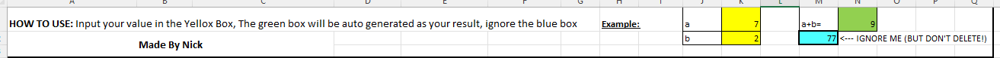
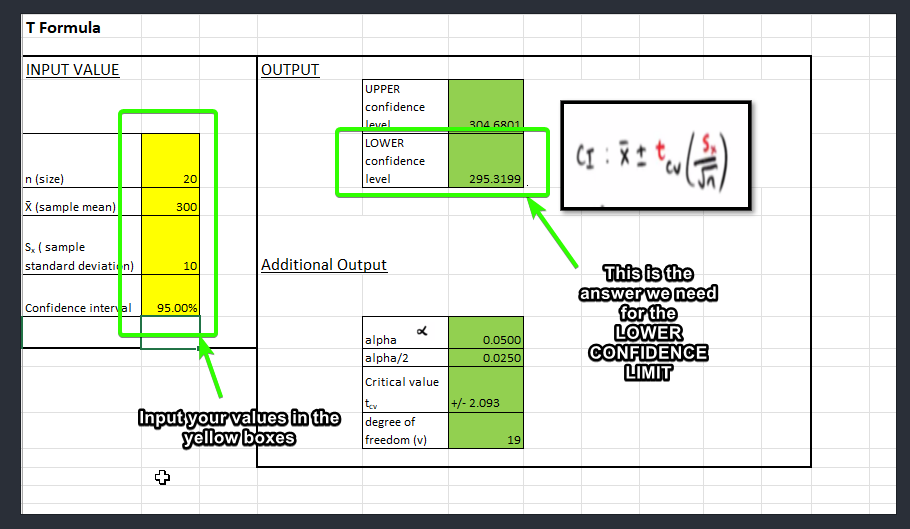
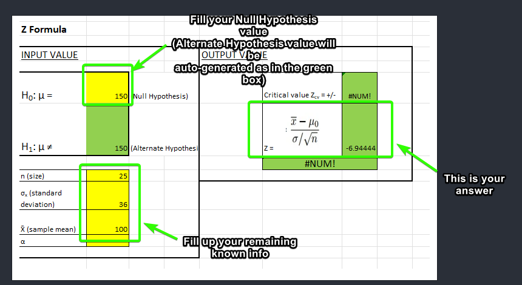
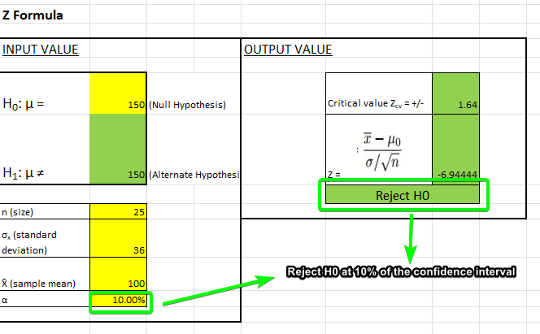

# Statistics Spreadsheet for Business Statistic Course 26134 (UTS):
- [Download Link](#download_link)
- [Sections (in Excel)](#sections)
- [How to use](#how_to_use)
- **Examples Questions:**
	- [Example 1](#ex_1)
	- [Example 2](#ex_2)
	- [Example 3](#ex_3)

## Download Link:
- [Click here to download the Spreadsheet](https://github.com/nicknggt/Business_Statistic_Excel_Stats_Tables/releases/download/v1.0/Distribution_stats_generator.xlsx)
- [\(Available in StuDocu\)](https://www.studocu.com/en-au/document/university-of-technology-sydney/business-statistics/statistic-table-auto-calculator-auto-excel-layout-calculations/23930622)

## Sections (in Excel):
- Inside the spreadsheet you can see these following sections:
	1. Discrete & Continuous Distribution
	2. Sampling Distribution
	3. Point & Interval Estimate
	4. Hypothesis Testing I
	5. Hypothesis Testing II
	6. Hypothesis Testing III
	7. Regresssion Analysis I II 

**Notes:** There are still some other sections in the field of study that are not included in the spreadsheets. I only included the most important one based on my perspective.

## How to use:
- Enter your value in the **YELLOW** box, the answer then will be auto-generated in the **GREEN** box. Don't worry/ignore the **BLUE** box and also, **DO NOT DELETE** it.

- To give you more understanding what can this spreadsheet does, the 3 examples will be given (I just took it from sample final exams):

### Example 1:
A manager wants to estimate the daily revenue of a branch. A sample of daily revenues of **20 daily revenues** had **mean** revenue of **$300** and **standard deviation of $10**. Based on this sample, what is the **lower confidence limit of the 95% confidence** interval of revenues?

In this question, these are the known given info:
	- n (size) is: **20**
	- sample mean is **300**
	- sample standard deviation is **10**
	- Confidence Interval is **95%**
	- **Finding lower confidence limit?**

From this question, we know that (you have to know) using **T Distribution** since the standard deviation is from the sample (not known from the population) and the confidence interval is given which belongs to **Point & Interval Estimate** section.

Your final answer is: **295.3199 (295.32)** for Lower Confidence Limit.

### Example 2:
The weekly profit of a restaurant follows a Normal distribution. **A sample of 25** weekly profit measurements had a **mean of 100**. If the **population standard deviation is $36**, what is the **test statistic** to test the hypothesis that the **mean profit of the restaurant is equal to $150**?

In this question, these are the known given info:
	- n (size): **25**
	- Sample Mean: **100**
	- **Population** Standard Deviation: **36** (**NOT SAMPLE** standard deviation).
	- Null Hypothesis (H0): **mean = 150**, (Not equal 150 as in alternate hypothesis H1)
	- **Test statistic** (**Z Stat** = ?)

This will belong to **Hypothesis Testing I** Using **Z Formula**

- Your final answer is **-6.94** when following Z stat formula, but just use **absolute value of it** (=6.94) for Z Statistic (it will **use absolute value of Z** to compare with Z critical value when considering if H0 should be reject or not so don't worry)
- _**(Z critical value and Hypothesis rejection or not are not known yet since the question doesn't give you the confidence level; it's only asked you to find the test statistic only!)**_

### Example 3:
Based on [Example 2](#ex_2), If the confidence interval is **10%**, should we reject H0 or not?
- Now the question is given the **alpha** value which is **10% (0.1)**:

- **Reject H0** is the answer since the _absolute Z stats_ is greater than the _Critical Z value_ **(6.94 > 1.64)**